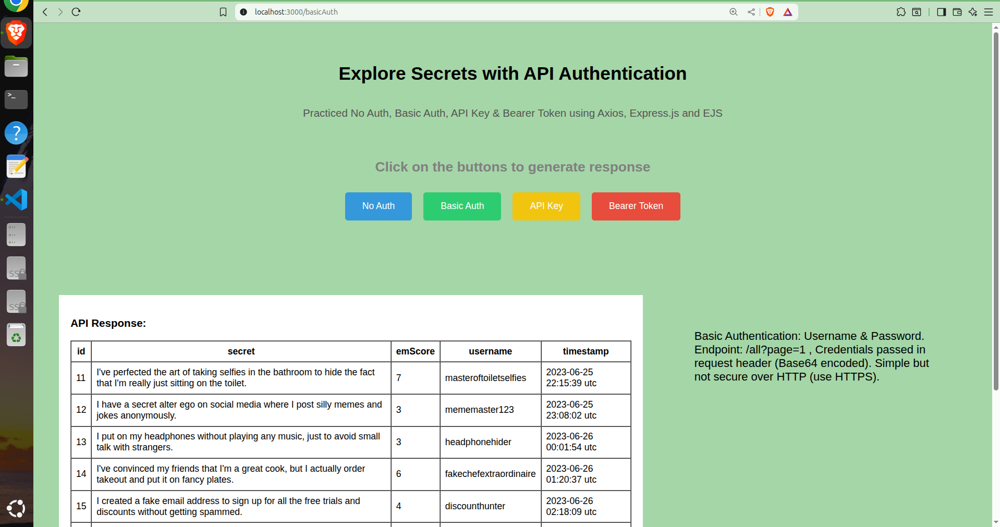
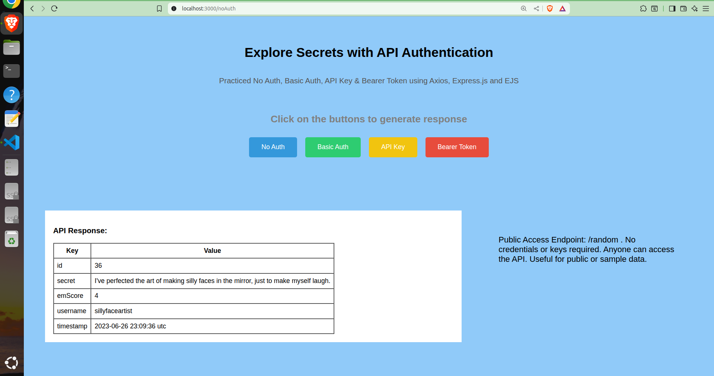

# Explore API Authentication

This project, **Explore API Authentication**, demonstrates various types of authentication mechanisms used in modern APIs. Built using Node.js and EJS, and Secrets API [ https://secrets-api.appbrewery.com/ ] this project visually represents how each authentication method works using interactive buttons and styled components.





## 🔍 What I Explored & Learned

In this project, I explored the **core authentication types** used in APIs:

1. **No Authentication** – Open APIs, no credentials required.
2. **Basic Authentication** – Credentials (username & password) encoded in base64.
3. **API Key** – A secret token passed as a header or query param.
4. **Bearer Token** – Token-based authentication (often used with OAuth 2.0).

I implemented a visual way to show how each works and learned how to:
- Design dynamic pages using **EJS templates**
- Use **Express.js** to handle routes and API calls
- Pass dynamic styling like color themes from backend to frontend
- Handle different auth headers in HTTP requests
- Structure authentication buttons and flows with clear UI/UX

---

## 🛠️ Tech Stack:

| Technology     | Role                         |
|----------------|------------------------------|
| **Node.js**     | Backend runtime              |
| **Express.js**  | Routing and server handling  |
| **EJS**         | Templating engine            |
| **Axios**    | HTTP requests to Secrets API              |

---

## API Endpoints Used:

| Endpoint                     | Auth Type    | Description                           |
| ---------------------------- | ------------ | ------------------------------------- |
| `/random`                    | No Auth      | Fetch a random public secret          |
| `/all?page=1`                | Basic Auth   | Fetch all secrets (paginated)         |
| `/filter?score=5&apiKey=...` | API Key      | Filter secrets by embarrassment score |
| `/secrets/:id`               | Bearer Token | Fetch a specific secret by ID         |


## 🔧 How to Run Locally 
### 1. Clone the Repository 
```bash git clone https://github.com/inshaxkhan/explore-api-authentication.git```
```cd explore-api-authentication ``` 

### 2. Install Dependencies 
```bash npm install ``` 

### 3. Run the Server 
```bash node index.js ``` 

### 4. Visit in Browser Open your browser and go to: 
``` http://localhost:3000 ``

